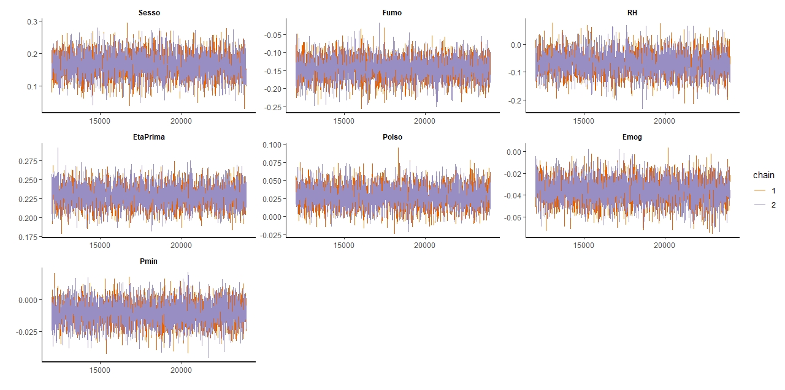
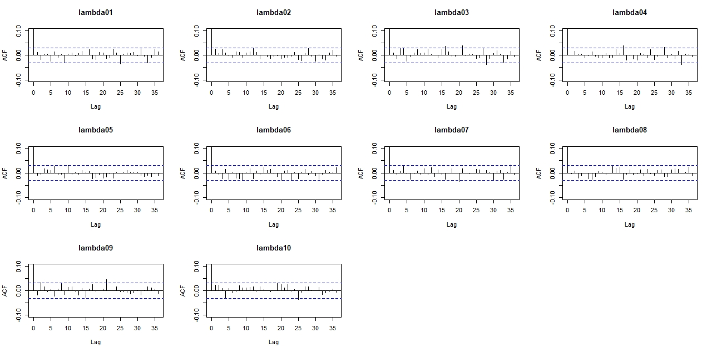

# BAYESIAN STATISTICS - AVIS: Modeling Recurrent Events

## Libraries that are needed:
- library(tidyverse)
- library(lubridate)
- library(ggplot2)
- library(rstan)
- library(coda)
- library(tidyr)
- library(dplyr)
- library(purrr)
- library(ggsci)
- library(bayesplot)
- library(rstanarm)
- require(gplots)
- require(ggpubr)
- library(arulesViz)

# READ_ME:
## Informations about our scripts:

1. Our datasets have been created using:
- donazioni_full.RData
- time_dependent.RData

2. In our code we use the following datasets:
- avis.RData            -> Used for the scripts names *01_descriptive_analysis.R* and *02_fit500_posterior_analysis.R*
- avis_clean_plus.RData -> Used for the script *03_time_dep_qualitative_analysis.R*
 

3. We fitted four models and we saved it with the following names:
- fit-500.RData   -> fit with only the first 500 donors
- fit_all.RData   -> fit with all the donors and all variables
- fit.RData       -> fit with all donors and only significant variables
- fit-fixed.RData -> fit of dott. Spinelli with only significant variables

4. We created our model in STAN with a time-dependent log-likelihood:
- time-dependent.stan

5. In the file *03_time_dep_qualitative_analysis.R* we draw the matplots for our time-dependent variables

6. The key-part of our code is the file *04_the_script*, in which we obtain:
- fit_all.RData
- fit.RData
- fit-fixed.RData
  
Some plots for the posterior analysis are present in the file just to see if our results were ok. 
A more detailed posterior analysis is performed in another script.

7. In the file *05_post_processing.R* you can find all the posterior analysis of the fit obtained in the previous script.

# BRIEF OVERVIEW OF THE PROJECT:
Our project consists in modeling recurrent events through time-dependent covariates.
In particular, our starting point is Dott.Spinelli's thesis, in which he works on the AVIS databases, in order to
analyse the process of blood donation in the collection centre of Lambrate. 
In his thesis he considers only with time-fixed covariates. Our goal is to extend the dataset including also 4 new
time-dependent covariates: heart rate, min and max pressure and hemoglobin.
After having obtained the fit of our model, we compare our results with the results obtained by Dott.Spinelli.
Here we report the most significant plots obtained in our work.

# THE MOST SIGNIFICANT PLOTS:

 ## Fit 500 donors
 
 Here we report the posterior densities, credible intervals, ACF plots and traceplots of our fit with only the first 500 donors and 100000 iterations, warmup 50000 and thin equal to 25. 

### Beta

### Lambda

### Frailties

### Frailties

## Qualitative behaviour of time dependent variables
By analyzing the second image, we can notice that the two variables on the left change more during time with respect to the other two; so we take this decision: hemoglobin and minimum pressure are kept time-dependent, while pulse and maximum pressure become time-fixed.
 

## Fit complete

Here we report some results obtained in our fit with all donors, 20000 iterations, warmup 12000 and thin equal to 4.

## Effect of the intercept

By reducing the model considering only relevant variables, sex becomes negative: against our intuition; it was positive before. Moreover RH becomes very negative around -12, while before it was around -0.1.

This suggests us to add an intercept:

## Fit reduced

The significant covariates that we consider in the reduced model are the following:
- "sex"
- "smoke"
- "age first donation"
- "RH"
- "Hemoglobin"
- "Pulse"
- "Minimum Pressure"

### Beta

### Lambda

